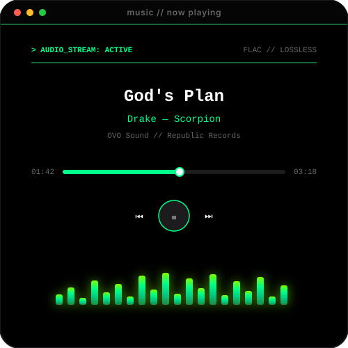

<!-- 1. ВЕРХ: Анимированный macOS Терминал zsh -->

  

<!-- 2. ЦЕНТР: Два горизонтальных окна 50/50 (Аватар + Музыкальный Плеер) -->
<table align="center" border="0" cellspacing="0" cellpadding="0" style="border: none; background: transparent; width: 100%; margin: 30px 0;">
  <tr style="border: none; background: transparent;">
    <td width="50%" align="center" style="border: none; background: transparent; padding: 15px; outline: none; box-shadow: none;">
      <a href="#" style="border: none; outline: none; box-shadow: none; text-decoration: none;">
        <!-- Ultra-HD ASCII Аватар -->
        
      </a>
    </td>
    <td width="50%" align="center" style="border: none; background: transparent; padding: 15px; outline: none; box-shadow: none;">
      <a href="#" style="border: none; outline: none; box-shadow: none; text-decoration: none;">
        <!-- Киберпанк Музыкальный Плеер с Эквалайзером -->
        
      </a>
    </td>
  </tr>
</table>

<!-- 3. НИЗ: Кастомный счетчик просмотров профиля с киберпанк стилем -->

  <svg width="280" height="70" xmlns="http://www.w3.org/2000/svg" viewBox="0 0 280 70">
    <defs>
      <linearGradient id="neonGreen" x1="0%" y1="0%" x2="100%" y2="100%">
        <stop offset="0%" style="stop-color:#00FF41;stop-opacity:1" />
        <stop offset="50%" style="stop-color:#39FF14;stop-opacity:1" />
        <stop offset="100%" style="stop-color:#00CC33;stop-opacity:1" />
      </linearGradient>
      <linearGradient id="bgGradient" x1="0%" y1="0%" x2="100%" y2="100%">
        <stop offset="0%" style="stop-color:#0f1729;stop-opacity:1" />
        <stop offset="100%" style="stop-color:#1a2855;stop-opacity:1" />
      </linearGradient>
      <filter id="glow">
        <feGaussianBlur stdDeviation="3" result="coloredBlur"/>
        <feMerge>
          <feMergeNode in="coloredBlur"/>
          <feMergeNode in="SourceGraphic"/>
        </feMerge>
      </filter>
      <filter id="shadow">
        <feDropShadow dx="0" dy="2" stdDeviation="3" flood-opacity="0.5"/>
      </filter>
    </defs>
    
    <!-- Фоновый прямоугольник с градиентом -->
    <rect width="280" height="70" fill="url(#bgGradient)" rx="8"/>
    
    <!-- Внешняя неоновая граница -->
    <rect width="280" height="70" fill="none" stroke="url(#neonGreen)" stroke-width="2" rx="8" filter="url(#glow)"/>
    
    <!-- Декоративные углы -->
    <g stroke="url(#neonGreen)" stroke-width="2" fill="none" filter="url(#glow)">
      <line x1="15" y1="10" x2="25" y2="10"/>
      <line x1="10" y1="15" x2="10" y2="25"/>
      <line x1="265" y1="10" x2="275" y2="10"/>
      <line x1="280" y1="15" x2="280" y2="25"/>
      <line x1="15" y1="60" x2="25" y2="60"/>
      <line x1="10" y1="55" x2="10" y2="65"/>
      <line x1="265" y1="60" x2="275" y2="60"/>
      <line x1="280" y1="55" x2="280" y2="65"/>
    </g>
    
    <!-- Основной текст -->
    <text x="140" y="38" font-family="'Courier New', monospace" font-size="18" font-weight="bold" fill="url(#neonGreen)" text-anchor="middle" filter="url(#glow)">
      ⚡ PROFILE VIEWS ⚡
    </text>
    
    <!-- Дополнительный текст внизу -->
    <text x="140" y="58" font-family="'Courier New', monospace" font-size="13" fill="#00FF41" text-anchor="middle" filter="url(#glow)" opacity="0.8">
      › ONLINE
    </text>
  </svg>

<!-- Разделитель -->

  

<!-- Дополнительная информация -->

  
  ### 💻 Full-Stack Developer | 🎨 UI/UX Enthusiast | 🚀 Innovation Seeker
  
  
  

